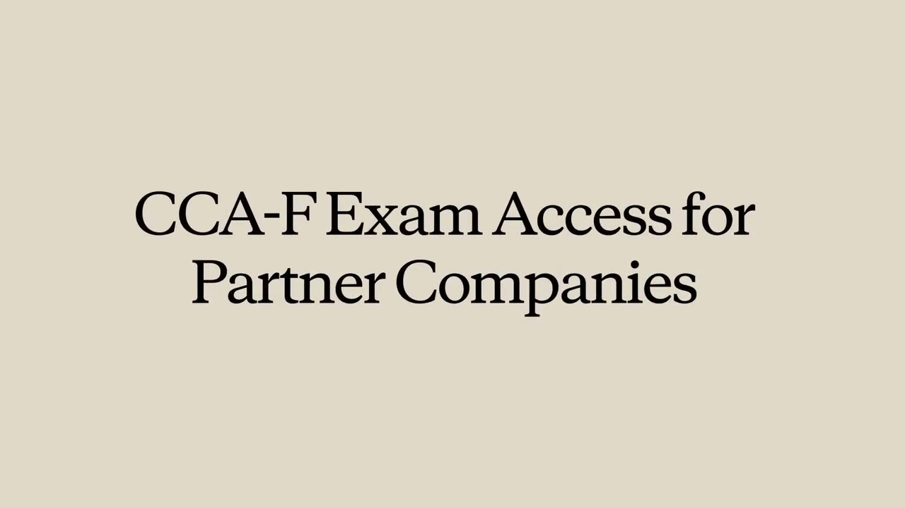
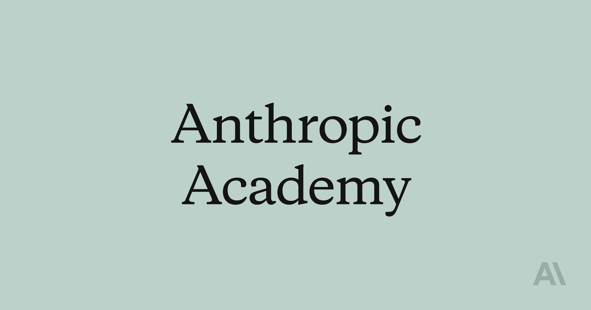

[English version](README.md)

# CCA-F Study Guide 备考与教学指南

> **Claude Certified Architect - Foundations (CCA-F)**
>
> 面向中文学习者、讲师和企业内部培训的系统化学习资料包。目标不是背题，而是建立可迁移的 Claude 架构判断能力：知道什么时候用智能体、什么时候用工具、什么时候用程序化约束，以及如何在真实工程场景里做可靠取舍。

[](https://anthropic.skilljar.com/claude-certified-architect-foundations-access-request)

访问申请入口：[Claude Certified Architect - Foundations Access Request](https://anthropic.skilljar.com/claude-certified-architect-foundations-access-request)

[](https://anthropic.skilljar.com/)

---

## 目录

- [这份指南适合谁](#这份指南适合谁)
- [你会学到什么](#你会学到什么)
- [一页看懂 CCA-F](#一页看懂-cca-f)
- [仓库怎么用](#仓库怎么用)
- [知识地图](#知识地图)
- [推荐学习路径](#推荐学习路径)
- [刷题与复盘方法](#刷题与复盘方法)
- [教学者使用建议](#教学者使用建议)
- [验收标准](#验收标准)
- [官方资源索引](#官方资源索引)
- [Awesome CCA-F 资源库](#awesome-cca-f-资源库)

---

## 这份指南适合谁

这份仓库可以作为三类场景的主教材：

| 使用者 | 典型目标 | 推荐用法 |
| --- | --- | --- |
| 个人备考者 | 快速建立考试题感并查漏补缺 | 按 7 天或 14 天路径学习，刷分域题并维护错题本 |
| 企业内训讲师 | 设计 CCA-F 备考课或 Claude 架构课 | 使用 domain 文档做讲义，labs 做演示，practice 做课堂练习 |
| 工程团队 | 把考试知识转成团队工程规范 | 将高频判断题沉淀到 CLAUDE.md、工具 schema、CI/CD 流程和代码评审 checklist |

建议学习者至少具备以下基础中的 3 项：

- 使用过 Claude API、Claude Code 或类似 LLM 工具调用框架。
- 参与过 Agent、工作流自动化、检索增强或数据抽取系统设计。
- 熟悉 JSON Schema、CLI、环境变量、CI/CD 的基本概念。
- 能阅读英文官方文档，并能做中英术语映射。

---

## 你会学到什么

学完本指南后，学习者应能完成以下任务：

1. 根据业务目标选择单智能体、多智能体、固定工作流或动态编排方案。
2. 设计清晰的工具接口、MCP 集成边界和结构化错误响应。
3. 配置 Claude Code 的项目规则、斜杠命令、技能、Hooks 与 CI/CD 非交互流程。
4. 使用 prompt、few-shot、JSON Schema、验证重试循环提升结构化输出稳定性。
5. 管理长上下文、多来源证据、错误传播、人工升级和可靠性边界。
6. 在场景题中识别“更工程化”的答案，而不是只选择看起来能工作的答案。

核心判断原则：

```text
高风险规则：程序化约束 > 提示词约束
工具误选：先改工具描述和输入契约 > 盲目增加 few-shot
复杂任务：先拆边界和上下文传递 > 直接启动所有子智能体
结构化输出：Schema + validation + retry > 自然语言要求
长上下文：保留事实、来源、状态 > 原样塞入完整历史
```

---

## 一页看懂 CCA-F

| 项目 | 说明 |
| --- | --- |
| 考试名称 | Claude Certified Architect - Foundations |
| 题型 | 单选题，通常为 1 个正确答案 + 3 个干扰项 |
| 评分 | 不倒扣分，建议全部作答 |
| 分数范围 | 100-1000 scaled score |
| 通过线 | **720 分** |
| 考试形式 | 围绕业务场景考查 Claude 架构设计与工程判断 |
| 资料优先级 | 官方考试指南 > Anthropic Docs > 本仓库整理 > 第三方资料 |

> 如果官方考试页面、考试指南 PDF 或考试平台信息发生变化，以官方当期说明为准。

### 域权重分布

```text
Domain 1: Agentic Architecture & Orchestration    ██████████████ 27%
Domain 2: Tool Design & MCP Integration           █████████      18%
Domain 3: Claude Code Configuration & Workflows   ██████████     20%
Domain 4: Prompt Engineering & Structured Output  ██████████     20%
Domain 5: Context Management & Reliability        ███████        15%
```

推荐投入顺序：**D1 > D3 = D4 > D2 > D5**。

### 6 大考试场景

| # | 场景 | 主要考查域 | 典型判断点 |
| --- | --- | --- | --- |
| 1 | 客户支持解决智能体 | D1、D2、D5 | 工具前置校验、退款门控、人工升级 |
| 2 | 使用 Claude Code 进行代码生成 | D3、D5 | CLAUDE.md、Plan Mode、路径规则 |
| 3 | 多智能体研究系统 | D1、D2、D5 | 协调者、子智能体上下文、来源归因 |
| 4 | Claude 驱动的开发者生产力工具 | D1、D2、D3 | 内置工具选择、MCP、代码库探索 |
| 5 | CI/CD 中的 Claude Code | D3、D4 | 非交互执行、JSON 输出、批量评审 |
| 6 | 结构化数据提取系统 | D4、D5 | Schema、验证重试、低置信度处理 |

详细说明见：[reference/exam-scenarios.md](zh/reference/exam-scenarios.md)

---

## 仓库怎么用

这个仓库按“概念理解 → 动手实践 → 题感训练 → 考前速查”组织。

```text
CCA-F/
├── README.md                         # 学习入口与教学指南
├── assets/                           # 首页图片资源
├── domains/                          # 五大考试域精讲
├── labs/                             # Jupyter 动手实验
├── practice/                         # 分域模拟题与官方样题解析
└── reference/                        # 场景、技巧、术语表
```

### 最短使用路径

1. 先读本 README，了解考试结构和学习顺序。
2. 读对应 domain 文档，建立概念框架。
3. 跑同编号 lab，把关键机制变成可运行例子。
4. 刷对应 practice 题，记录错因标签。
5. 用 reference 做考前复盘和术语速查。

### 资料导航

| 类型 | 文件 | 怎么用 |
| --- | --- | --- |
| D1 精讲 | [domains/01-agentic-architecture.md](zh/domains/01-agentic-architecture.md) | 优先学习，覆盖智能体循环、多智能体、Hooks、任务分解 |
| D2 精讲 | [domains/02-tool-design-mcp.md](zh/domains/02-tool-design-mcp.md) | 工具描述、MCP 错误、工具分配、内置工具选择 |
| D3 精讲 | [domains/03-claude-code.md](zh/domains/03-claude-code.md) | CLAUDE.md、斜杠命令、Skills、Hooks、CI/CD |
| D4 精讲 | [domains/04-prompt-engineering.md](zh/domains/04-prompt-engineering.md) | 显式标准、few-shot、JSON Schema、验证重试、批处理 |
| D5 精讲 | [domains/05-context-management.md](zh/domains/05-context-management.md) | 长上下文、升级、错误传播、来源归因、可靠性 |
| 实验说明 | [labs/README.md](zh/labs/README.md) | 配置 API Key 并运行 notebooks |
| 官方样题 | [practice/official-sample-questions.md](zh/practice/official-sample-questions.md) | 用来校准真实题目风格 |
| 模拟题 | [practice/](zh/practice/) | 每个 domain 60 题，按 task statement 划分 |
| 场景说明 | [reference/exam-scenarios.md](zh/reference/exam-scenarios.md) | 讲课和考前复盘主线 |
| 考试技巧 | [reference/exam-tips.md](zh/reference/exam-tips.md) | 高频信号词、失分点、答题原则 |
| 术语表 | [reference/glossary.md](zh/reference/glossary.md) | 中英术语、配置位置、stop_reason 速查 |

---

## 知识地图

### 五大域学习主线

| Domain | 权重 | 学习主线 | 工程判断 |
| --- | ---: | --- | --- |
| D1 Agentic Architecture | 27% | loop、subagent、hooks | 模型决策 vs 程序强制 |
| D2 Tool Design & MCP | 18% | schema、MCP error、tool_choice | 工具边界决定选择质量 |
| D3 Claude Code | 20% | CLAUDE.md、commands、skills | 团队规则要可复用 |
| D4 Prompt Engineering | 20% | criteria、few-shot、schema | 稳定输出依赖验证闭环 |
| D5 Context Reliability | 15% | context、escalation、provenance | 长任务要保事实和来源 |

### 四项核心技术与 Anthropic 课程

| 核心技术 | Anthropic 对应课程 | 本仓库重点 |
| --- | --- | --- |
| **Claude Agent SDK** | [Introduction to subagents](https://anthropic.skilljar.com/introduction-to-subagents) | 多智能体委托、上下文隔离、任务拆分策略 |
| **Claude Code** | [Claude Code in Action](https://anthropic.skilljar.com/claude-code-in-action) | CLAUDE.md、Hooks、命令、Skills、CI/CD |
| **Claude API** | [Building with the Claude API](https://anthropic.skilljar.com/claude-with-the-anthropic-api) | tool_use、结构化输出、消息历史管理 |
| **Model Context Protocol (MCP)** | [Introduction to Model Context Protocol](https://anthropic.skilljar.com/introduction-to-model-context-protocol) | 工具、资源、传输方式、集成边界 |

补充课程：

- [Claude Code 101](https://anthropic.skilljar.com/claude-code-101)
- [Model Context Protocol: Advanced Topics](https://anthropic.skilljar.com/model-context-protocol-advanced-topics)
- [Introduction to agent skills](https://anthropic.skilljar.com/introduction-to-agent-skills)

### 高频考点速查

| 信号词 | 优先答案方向 | 常见错误方向 |
| --- | --- | --- |
| 必须保证、合规、退款、权限 | Hooks、前置门控、后端校验 | 只加强系统提示 |
| 工具总选错、相似工具混用 | 改工具名、描述、schema、边界说明 | 盲目加 few-shot |
| 循环停不下来 | 检查 `stop_reason` 与 `tool_result` | 解析“任务完成”等自然语言 |
| 子智能体拿不到信息 | 调用时显式传上下文和来源元数据 | 期待自动继承父会话 |
| CI 里卡住 | `-p/--print`、非交互、结构化输出 | 沿用交互式运行 |
| 结构化字段缺失 | JSON Schema required、nullable、validation | 靠自然语言要求 |
| 结果无法追溯 | 保留 source、page、URL、confidence | 只传摘要，不传元数据 |

完整说明见：[reference/exam-tips.md](zh/reference/exam-tips.md)

---

## 推荐学习路径

### 路径 A：14 天稳扎稳打

适合没有系统学过 Claude 架构，但有工程基础的学习者。

| 天数 | 学习目标 | 阅读 | 实践 | 输出物 |
| --- | --- | --- | --- | --- |
| Day 1-3 | 吃透 D1 | Domain 1 | Lab 01 + D1 前 30 题 | agent loop 与 subagent 对照笔记 |
| Day 4-6 | 攻克 D3 | Domain 3 | Lab 03 + D3 题目 | CLAUDE.md 与 CI/CD checklist |
| Day 7-9 | 攻克 D4 | Domain 4 | Lab 04 + D4 题目 | 结构化输出设计模板 |
| Day 10-11 | 补 D2 | Domain 2 | Lab 02 + D2 题目 | 工具描述与 MCP 错误模板 |
| Day 12 | 补 D5 | Domain 5 | Lab 05 + D5 题目 | 上下文可靠性 checklist |
| Day 13 | 官方样题复盘 | official sample | 按场景重做错题 | 错因分布表 |
| Day 14 | 考前总复盘 | glossary + tips | 不做新题，只看错题 | 个人速查表 |

### 路径 B：7 天冲刺

适合已做过 Claude API、Claude Code 或 Agent 项目的学习者。

1. Day 1：D1 + D3 核心机制框架化梳理。
2. Day 2：D4 全量过一遍，重点是 Schema、few-shot、温度、Batch。
3. Day 3：D2 + D5 高频陷阱题。
4. Day 4-5：分域刷题，按 task statement 统计错因。
5. Day 6：官方样题 + 6 大场景复盘。
6. Day 7：只看错题、术语表和速查表，不再新增材料。

### 路径 C：3 天临考补救

只适合已有实战经验、时间非常紧的学习者。

| 天数 | 做什么 | 不做什么 |
| --- | --- | --- |
| Day 1 | D1、D3、D4 各读一遍“这题怎么考”和反模式 | 不逐字精读所有代码示例 |
| Day 2 | 官方样题 + 每个 domain 20 道题 | 不追求刷题数量，重点写错因 |
| Day 3 | exam-tips、glossary、错题本 | 不再学习新第三方资料 |

---

## 刷题与复盘方法

### 5 步答题法

1. 先识别题干关键词：确定性、合规、并行、CI、低置信度、上下文过长。
2. 判断题目问的是“第一步”、“最佳方案”还是“根本原因”。
3. 在候选项中优先找程序化、可审计、可复现的方案。
4. 如果两个选项都能工作，选择边界更清楚、失败模式更可控的那个。
5. 题后写错因标签，不要只记正确答案。

### 错题标签

| 标签 | 说明 | 复盘动作 |
| --- | --- | --- |
| 概念错 | 不知道术语或机制 | 回到 domain 文档补概念 |
| 边界错 | 知道概念但选错适用场景 | 写“何时不用”反例 |
| 读题错 | 忽略第一步、最佳方案、根因等限定 | 圈出题干动词 |
| 工程错 | 选择了能跑但不可靠的方案 | 改写成 checklist |
| 术语错 | 英文术语与中文理解错位 | 补到 glossary |

### 错题本模板

```md
## Q 编号 / 来源

- 所属域：
- 题干关键词：
- 我选：
- 正确答案：
- 错因标签：
- 为什么正确答案更工程化：
- 下次看到什么信号词要警惕：
```

### 做题节奏

- 第一轮：不限时，重点理解每个选项为什么错。
- 第二轮：按 domain 限时，训练识别信号词。
- 第三轮：混合题，模拟真实场景切换。
- 考前 24 小时：只看错题本、术语表和高频失分点。

---

## 动手实验

Labs 用于把考试概念转成可运行的工程样例。每个 notebook 对应一个 domain。

```bash
pip install anthropic python-dotenv jupyter
export ANTHROPIC_API_KEY="your_api_key_here"
jupyter notebook
```

| Notebook | 对应 Domain | 核心示例 |
| --- | --- | --- |
| [labs/01-agentic-architecture.ipynb](zh/labs/01-agentic-architecture.ipynb) | D1 | 智能体循环、多智能体编排、Hooks |
| [labs/02-tool-design-mcp.ipynb](zh/labs/02-tool-design-mcp.ipynb) | D2 | 工具定义、MCP 集成、错误处理 |
| [labs/03-claude-code.ipynb](zh/labs/03-claude-code.ipynb) | D3 | CLAUDE.md 结构、CI/CD 集成 |
| [labs/04-prompt-engineering.ipynb](zh/labs/04-prompt-engineering.ipynb) | D4 | JSON Schema 输出、Few-shot、批处理 |
| [labs/05-context-management.ipynb](zh/labs/05-context-management.ipynb) | D5 | 长文档处理、上下文压缩、错误传播 |

详细环境说明见：[labs/README.md](zh/labs/README.md)

---

## 教学者使用建议

### 90 分钟工作坊模板

| 时间 | 内容 | 推荐材料 |
| ---: | --- | --- |
| 10 分钟 | 考试结构、评分机制、域权重 | README + exam-tips |
| 20 分钟 | D1 与 D3 关键机制对照 | Domain 1、Domain 3 |
| 20 分钟 | 现场跑 1 个 notebook | 建议 Lab 03 或 Lab 01 |
| 25 分钟 | 场景题拆解 | exam-scenarios + official sample |
| 15 分钟 | 错题归因和冲刺建议 | 错题标签 + exam-tips |

### 半天课程模板

| 模块 | 时长 | 内容 |
| --- | ---: | --- |
| Module 1 | 30 分钟 | CCA-F 全景、五大域、六大场景 |
| Module 2 | 60 分钟 | D1 智能体架构与多智能体编排 |
| Module 3 | 45 分钟 | D3 Claude Code 工程化配置 |
| Module 4 | 45 分钟 | D4 结构化输出与验证重试 |
| Module 5 | 30 分钟 | D2/D5 高频陷阱 |
| Module 6 | 45 分钟 | 混合场景题演练和错题复盘 |

### 讲师备课清单

- 课前确认官方考试指南、Skilljar 访问入口和 Anthropic Docs 链接是否仍有效。
- 准备一个能跑通的 Claude Code 或 Claude API 示例，避免只讲概念。
- 每个 domain 至少准备 2 个“正确做法 vs 反模式”的对照案例。
- 课堂练习优先用场景题，不要把时间花在术语默写上。
- 课后要求学员提交错题本，而不是只提交刷题分数。

### 学员课后作业

1. 完成 1 个 domain 的一页纸笔记：术语、机制、适用边界、反模式。
2. 完成 20 道对应模拟题，并为每道错题写错因标签。
3. 任选 1 个错题改写成“反例题”，解释为什么干扰项看起来合理但不够工程化。
4. 把一个高频考点转成团队 checklist，例如工具描述模板、CI 非交互命令模板或结构化输出验证模板。

---

## 验收标准

备考不是看完材料就结束。建议用下面的标准判断是否已经准备好：

| 能力 | 达标表现 |
| --- | --- |
| 概念解释 | 能不用背诵说明 5 个 domain 的核心差异 |
| 场景判断 | 能在 30 秒内识别题目主要考查哪个 domain |
| 反模式识别 | 能解释为什么“只改提示词”在高风险场景不够 |
| 工程迁移 | 能把一道题转成真实项目里的规则、Hook、schema 或流程 |
| 错题复盘 | 每道错题都有错因标签和下次识别信号 |
| 考前稳定性 | 混合题正确率稳定，且弱项集中在少数 task statement |

---

## 官方资源索引

### 认证与课程

| 类型 | 资源 | 用途 |
| --- | --- | --- |
| 认证入口 | [CCA-F 访问申请](https://anthropic.skilljar.com/claude-certified-architect-foundations-access-request) | 申请认证课程与考试访问权限 |
| 考试说明 | [CCA-F 官方考试指南 PDF](https://everpath-course-content.s3-accelerate.amazonaws.com/instructor%2F8lsy243ftffjjy1cx9lm3o2bw%2Fpublic%2F1773274827%2FClaude+Certified+Architect+%E2%80%93+Foundations+Certification+Exam+Guide.pdf) | 核对考试范围、域权重和样题 |
| 课程平台 | [Anthropic Academy](https://anthropic.skilljar.com/) | 查找官方课程和认证学习路径 |
| Agent 课程 | [Introduction to subagents](https://anthropic.skilljar.com/introduction-to-subagents) | 学习子智能体和任务委托 |
| Claude Code 课程 | [Claude Code 101](https://anthropic.skilljar.com/claude-code-101) | Claude Code 入门 |
| Claude Code 课程 | [Claude Code in Action](https://anthropic.skilljar.com/claude-code-in-action) | Claude Code 工作流示例 |
| API 课程 | [Building with the Claude API](https://anthropic.skilljar.com/claude-with-the-anthropic-api) | 学习 Messages API 与工具调用 |
| MCP 课程 | [Introduction to MCP](https://anthropic.skilljar.com/introduction-to-model-context-protocol) | MCP 基础概念 |
| MCP 课程 | [MCP Advanced Topics](https://anthropic.skilljar.com/model-context-protocol-advanced-topics) | MCP 进阶主题 |
| Skills 课程 | [Introduction to agent skills](https://anthropic.skilljar.com/introduction-to-agent-skills) | 学习技能组织方式 |

### Claude API 与模型

| 类型 | 资源 | 用途 |
| --- | --- | --- |
| 文档首页 | [Anthropic Docs](https://docs.anthropic.com/) | 官方文档总入口 |
| 快速开始 | [Get started with Claude](https://docs.anthropic.com/en/docs/quickstart) | 第一次 API 调用 |
| 模型选择 | [Models overview](https://docs.anthropic.com/en/docs/models-overview) | 查看模型能力、上下文和模型名 |
| API 示例 | [Messages examples](https://docs.anthropic.com/en/api/messages-examples) | 学习 Messages API 请求格式 |
| 工具调用 | [How to implement tool use](https://docs.anthropic.com/en/docs/agents-and-tools/tool-use/implement-tool-use) | tool_use、tool_result 和工具 schema |
| 批处理 | [Batch processing](https://docs.anthropic.com/en/docs/build-with-claude/batch-processing) | 大规模离线任务和批量评审 |

### Claude Code

| 类型 | 资源 | 用途 |
| --- | --- | --- |
| 总览 | [Claude Code overview](https://docs.anthropic.com/en/docs/claude-code/overview) | 了解 Claude Code 能力边界 |
| 快速开始 | [Claude Code quickstart](https://docs.anthropic.com/en/docs/claude-code/quickstart) | 安装、登录和基础使用 |
| CLI | [CLI reference](https://docs.anthropic.com/en/docs/claude-code/cli-reference) | `-p`、JSON 输出、resume 等参数 |
| 配置 | [Claude Code settings](https://docs.anthropic.com/en/docs/claude-code/settings) | settings、权限、工具和层级配置 |
| 记忆 | [Manage Claude's memory](https://docs.anthropic.com/en/docs/claude-code/memory) | CLAUDE.md 层级和 `/memory` |
| 命令 | [Slash commands](https://docs.anthropic.com/en/docs/claude-code/slash-commands) | 内置命令和自定义命令 |
| Hooks 入门 | [Get started with hooks](https://docs.anthropic.com/en/docs/claude-code/hooks-guide) | 用 Hooks 固化工作流规则 |
| Hooks 参考 | [Hooks reference](https://docs.anthropic.com/en/docs/claude-code/hooks) | PreToolUse、PostToolUse 等事件 |
| 子智能体 | [Subagents](https://docs.anthropic.com/en/docs/claude-code/sub-agents) | 子智能体配置、工具权限和上下文隔离 |
| MCP 集成 | [Claude Code MCP](https://docs.anthropic.com/en/docs/claude-code/mcp) | 在 Claude Code 中接入 MCP |

### MCP 与工具生态

| 类型 | 资源 | 用途 |
| --- | --- | --- |
| MCP 总览 | [Model Context Protocol](https://docs.anthropic.com/en/docs/mcp) | MCP 概念、产品集成和协议入口 |
| API 集成 | [MCP connector](https://docs.anthropic.com/en/docs/agents-and-tools/mcp-connector) | 在 Messages API 中连接远程 MCP 服务器 |

### 提示工程、结构化输出与可靠性

| 类型 | 资源 | 用途 |
| --- | --- | --- |
| 提示工程 | [Prompt engineering overview](https://docs.anthropic.com/en/docs/prompt-engineering) | 官方提示工程方法总览 |
| 提示模板 | [Prompt templates and variables](https://docs.anthropic.com/en/docs/build-with-claude/prompt-engineering/prompt-templates-and-variables) | 固定内容与变量内容分离 |
| 提示优化 | [Prompt improver](https://docs.anthropic.com/en/docs/build-with-claude/prompt-engineering/prompt-improver) | 迭代改进复杂提示 |
| 长上下文 | [Long context prompting tips](https://docs.anthropic.com/en/docs/build-with-claude/prompt-engineering/long-context-tips) | 多文档、来源和长上下文组织 |
| 上下文窗口 | [Context windows](https://docs.anthropic.com/en/docs/build-with-claude/context-windows) | 理解上下文限制和长上下文能力 |
| Prompt caching | [Prompt caching](https://docs.anthropic.com/en/docs/build-with-claude/prompt-caching) | 降低重复长提示的成本和延迟 |
| Token 计数 | [Token counting](https://docs.anthropic.com/en/docs/build-with-claude/token-counting) | 请求前估算 token 与成本 |
| 引用 | [Citations](https://docs.anthropic.com/en/docs/build-with-claude/citations) | 多来源回答的可追溯性 |

### 测试与评估

| 类型 | 资源 | 用途 |
| --- | --- | --- |
| 评估工具 | [Using the Evaluation Tool](https://docs.anthropic.com/en/docs/test-and-evaluate/eval-tool) | 在 Console 中测试提示效果 |
| 构建评测 | [Create strong empirical evaluations](https://docs.anthropic.com/en/docs/test-and-evaluate/develop-tests) | 设计可复现的评测集和测试用例 |

---

## Awesome CCA-F 资源库

> 最后检索：2026-04-26。以下是公开网络中与 CCA-F 备考、教学、题感训练和工程实践直接相关的资料。除 Anthropic 官方资源外，其余均为社区或第三方资料，请以官方考试指南为最终依据。

### 资料可信度分级

| 等级 | 类型 | 使用原则 |
| --- | --- | --- |
| A | Anthropic 官方 | 作为考试范围、术语和产品行为的最终依据 |
| B | 开源项目 | 可参考结构、代码和题型，但要自行核对答案 |
| C | 第三方课程/题库 | 适合补充练习，不应替代官方资料 |
| D | 社区经验帖 | 适合了解考试体感和争议点，不当作事实依据 |

### 官方与准官方背景

| 资源 | 类型 | 推荐用途 |
| --- | --- | --- |
| [Claude Partner Network announcement](https://www.anthropic.com/news/claude-partner-network) | 官方新闻 | 理解 CCA-F 与 Partner Network 的关系 |
| [Claude Partner Network](https://claude.com/partners) | 官方入口 | 查看合作伙伴、认证和 Partner Portal 入口 |
| [CCA-F 访问申请](https://anthropic.skilljar.com/claude-certified-architect-foundations-access-request) | 官方入口 | 申请认证课程和考试访问权限 |
| [CCA-F 官方考试指南 PDF](https://everpath-course-content.s3-accelerate.amazonaws.com/instructor%2F8lsy243ftffjjy1cx9lm3o2bw%2Fpublic%2F1773274827%2FClaude+Certified+Architect+%E2%80%93+Foundations+Certification+Exam+Guide.pdf) | 官方 PDF | 核对 domain、task statement、场景和样题 |
| [Building effective agents](https://www.anthropic.com/research/building-effective-agents) | 官方研究 | D1、D2 的核心背景材料 |
| [Best practices for Claude Code](https://www.anthropic.com/engineering/claude-code-best-practices) | 官方工程 | D3 Claude Code 实战最佳实践 |
| [Building agents with the Claude Agent SDK](https://www.anthropic.com/engineering/building-agents-with-the-claude-agent-sdk/) | 官方工程 | Agent SDK、subagents、tool loop |
| [Claude Code Advanced Patterns](https://www.anthropic.com/webinars/claude-code-advanced-patterns) | 官方 webinar | subagents、MCP、大型代码库实践 |
| [Claude Code plugins](https://www.anthropic.com/news/claude-code-plugins) | 官方新闻 | Skills、Hooks、subagents、MCP 打包方式 |

### 开源学习指南与资料库

| 资源 | 类型 | 推荐用途 |
| --- | --- | --- |
| [paullarionov/claude-certified-architect](https://github.com/paullarionov/claude-certified-architect) | 多语言指南 | 英/中/日/西/俄/乌尔都语学习材料和 PDF |
| [English guide](https://github.com/paullarionov/claude-certified-architect/blob/main/guide_en.MD) | 长文指南 | 系统阅读 CCA-F 全域知识点 |
| [Chinese guide](https://github.com/paullarionov/claude-certified-architect/blob/main/guide_zh.md) | 中文指南 | 中文学习者快速对照术语 |
| [aderegil/claude-certified-architect](https://github.com/aderegil/claude-certified-architect) | Guided labs | 6 场景、5 域、30 task 的实验资料 |
| [CCA Foundations Mock Exam](https://github.com/neerajkr7/cca-foundations-exam-practice) | 开源 mock exam | 100 道离线场景题，可部署为静态站点 |
| [Mock Exam live site](https://neerajkr7.github.io/cca-foundations-exam-practice/) | 在线练习 | 无登录、无 API key 的免费练习入口 |
| [Architect Cert MCP](https://github.com/Connectry-io/connectrylab-architect-cert-mcp) | MCP 学习工具 | 390 题、间隔重复、capstone、参考项目 |
| [Architect Cert overview](https://mcpmarket.com/server/architect-cert) | MCP 目录 | 快速了解工具能力和安装价值 |
| [Agent Engineering Skill](https://gist.github.com/antoniopresto/3e0b9849339170075c8f82bb61b75255) | Gist | 把 CCA-F domain 转成 Claude Code 工程技能 |

### Claude Code 与 Agent 工程参考

| 资源 | 类型 | 推荐用途 |
| --- | --- | --- |
| [Claude Code Ultimate Guide](https://github.com/FlorianBruniaux/claude-code-ultimate-guide/blob/main/guide/core/architecture.md) | 社区深潜 | 理解 Claude Code loop、tool、context、session |
| [Claude Code Architecture Deep Dive](https://gist.github.com/yanchuk/0c47dd351c2805236e44ec3935e9095d) | Gist | 参考 Claude Code 内部架构分析 |
| [Claude Code Infrastructure Showcase](https://github.com/diet103/claude-code-infrastructure-showcase) | 实战模板 | Skills、Hooks、agents 的项目级组织方式 |
| [Awesome Claude Code Agents](https://github.com/supatest-ai/awesome-claude-code-sub-agents) | Agent 集合 | 参考 subagent 职责划分和描述写法 |
| [Claude Code Unified Agents](https://github.com/stretchcloud/claude-code-unified-agents) | Agent 集合 | 参考多类型 subagent 的组织方式 |
| [AI Software Architect](https://github.com/codenamev/ai-software-architect) | 架构框架 | 参考 ADR、架构审查和多助手工作流 |
| [ccsetup](https://github.com/MrMarciaOng/ccsetup) | 项目脚手架 | 参考 Claude Code 项目初始化和 agent 编排 |
| [cc-skills](https://github.com/terrylica/cc-skills) | Skills 市场 | 参考 Skills、plugins、hooks 的组织方式 |
| [Prompt Architect](https://github.com/ckelsoe/prompt-architect) | Prompt skill | D4 prompt framework 与提示改写练习 |

### 免费练习与样题

| 资源 | 类型 | 推荐用途 |
| --- | --- | --- |
| [Scrolly CCA-F Study Guide](https://www.scrolly.to/s/ccaf-study-guide) | 交互指南 | 快速浏览 domain、场景和 30 道练习题 |
| [Claude Certification Guide mock exam](https://claudecertificationguide.com/mock-exam) | 免费 mock | 进行整套模拟练习 |
| [ReadRoost practice questions](https://readroo.st/blog/cca-foundations-practice-questions) | 免费题目 | 补充场景题训练 |
| [CCA sample questions PDF](https://claudecertified.com/downloads/cca-sample-5q.pdf) | 样题 PDF | 体验第三方样题格式 |
| [Panaversity CCA-F page](https://panaversity.org/certifications/exams/CCA-F) | 课程页 | 快速查看 domain、场景和备考定位 |

### 第三方题库与付费课程

| 资源 | 类型 | 推荐用途 |
| --- | --- | --- |
| [Claude Certified Architect Practice](https://www.claudecertifiedarchitect.dev/) | 题库平台 | 大量场景题、模拟考试和分域诊断 |
| [Claude Certified Architects Prep](https://www.claudecertifiedarchitects.com/) | 课程/题库 | 课程化备考和 full-length practice exam |
| [ClaudeCertified practice questions](https://claudecertified.com/cca-practice-questions) | PDF 题库 | 小规模题库和样题 PDF |
| [Claude Architect Lab](https://www.anthropiccertifications.com/) | 题库平台 | adaptive practice、mock exam、AI tutor |
| [Udemy practice exams](https://www.udemy.com/course/claude-certified-architect-foundations-practice-tests-2026/) | 付费课程 | 额外模拟题训练 |
| [Udemy 360 questions](https://www.udemy.com/course/claude-certified-architect-foundations-practice-tests-u/) | 付费课程 | 多套 practice test |
| [Udemy mock exam with explanation](https://www.udemy.com/course/claude-certified-architect-mock-exam-with-answer-explanation/) | 付费课程 | 带解析的模拟考试 |

### 博客攻略与学习计划

| 资源 | 类型 | 推荐用途 |
| --- | --- | --- |
| [Claude Certified Architect Exam Guide 2026](https://www.claudecertifiedarchitects.com/blog/cca-foundations-exam-guide-2026/) | 第三方攻略 | 了解题型、domain、时间线和样题解析 |
| [Preporato Complete Guide](https://preporato.com/blog/claude-certified-architect-complete-guide-2026) | 第三方攻略 | 全域备考 checklist 和反模式整理 |
| [AI.cc CCA-F guide](https://www.ai.cc/blogs/claude-certified-architect-foundations-cca-f-exam-guide-2026/) | 第三方攻略 | 认证背景、考试结构、准入信息 |
| [ThinkSmart complete guide](https://thinksmart.life/research/posts/claude-certified-architect-study-guide/) | 第三方攻略 | 五大域、六大场景和样题概览 |
| [AI Productivity prep guide](https://aiproductivity.ai/blog/claude-certified-architect-guide/) | 第三方攻略 | 备考建议、常见误区和资源整合 |
| [Vorantis CCA guide](https://www.vorantis.co/blog/claude-certified-architect-cca-guide) | 第三方攻略 | 认证定位、学习路径和职业价值 |
| [DataStudios access analysis](https://www.datastudios.org/post/claude-certified-architect-foundations-what-it-is-who-it-is-for-how-it-fits-anthropic-s-partner) | 分析文章 | 理解 partner access 与公开可用性的边界 |
| [Sundeep Teki career angle](https://www.sundeepteki.org/advice) | 职业视角 | 将 CCA-F 映射到 FDE 和企业 AI 交付能力 |
| [Finstor 14-day study plan](https://www.finstor.in/wp-content/uploads/2026/03/CCA-F_14Day_Study_Plan.pdf) | PDF 计划 | 参考 14 天冲刺安排 |
| [CertStud study notes](https://certstud.com/pdfs/anthropic-claude-architect-study-notes.pdf) | PDF 笔记 | 考前速查补充 |
| [Unofficial handbook](https://rominur.com/Claude-Code-Architect-Handbook-2026.pdf) | PDF 手册 | 非官方长文 handbook |

### 社区经验帖

| 资源 | 类型 | 推荐用途 |
| --- | --- | --- |
| [Notes from studying the exam guide](https://www.reddit.com/r/ClaudeCode/comments/1s3hbv3/notes_from_studying_the_claude_certified/) | Reddit 笔记 | 看别人如何拆官方指南 |
| [Real exam has more scenarios](https://www.reddit.com/r/ClaudeAI/comments/1s34iyl/ccaf_the_real_exam_has_more_scenarios_than_the/) | Reddit 经验 | 了解实际考试和指南可能存在差异 |
| [Passed with 893/1000](https://www.reddit.com/r/ClaudeAI/comments/1sgn0cf/passed_anthropics_claude_certified_architect/) | Reddit 经验 | 参考通过者复盘 |
| [Passed with 985/1000](https://www.reddit.com/r/ClaudeAI/comments/1ruf70b/just_passed_the_new_claude_certified_architect/) | Reddit 经验 | 参考高分者体感和 mock exam 链接 |
| [Free 100-question mock exam](https://www.reddit.com/r/ClaudeAI/comments/1skbf1i/i_built_a_free_100question_cca_foundations_mock/) | Reddit 项目帖 | 追踪开源 mock exam 讨论和反馈 |
| [Labs for CCA-F](https://www.reddit.com/r/ClaudeAI/comments/1sip8jd/labs_for_claude_certified_architect_foundations/) | Reddit 项目帖 | 追踪 guided labs 讨论 |
| [Q&A prep guide](https://www.reddit.com/r/ClaudeAI/comments/1sb37sf/i_made_a_qa_prep_guide_for_the_anthropic_claude/) | Reddit 项目帖 | 补充问答式复习材料 |
| [Anki deck thread](https://www.reddit.com/r/ClaudeAI/comments/1sp9nz0/claude_certified_architect_foundations/) | Reddit 资料 | 间隔记忆卡片资源线索 |
| [Anthropic subreddit Anki thread](https://www.reddit.com/r/Anthropic/comments/1sq0fut/claude_certified_architect_foundations/) | Reddit 资料 | Anki deck 备用讨论入口 |
| [Any review on CCA?](https://www.reddit.com/r/ClaudeAI/comments/1rv5t3r/any_review_on_claude_certified_architect/) | Reddit 讨论 | 了解争议、难度和考试体感 |

### 如何使用这些外部资料

1. 先用官方考试指南和 Anthropic Docs 确认范围。
2. 再用开源 guide 和 labs 补知识结构。
3. 之后用 mock exam 和题库训练场景判断。
4. 遇到第三方答案和官方文档冲突时，以官方文档为准。
5. 社区经验只用于发现盲区，不用于背诵结论。

---

## 维护原则

- 本仓库目标是维护为 **中文 CCA-F 课程化资料包**。
- 官方考试指南更新时，优先同步考试结构、域权重、场景描述和官方样题。
- 新增内容应服务于三件事：概念更清晰、题感更稳定、实践可复现。
- 第三方题库、博客和经验帖必须标注来源类型，避免与官方资料混淆。
